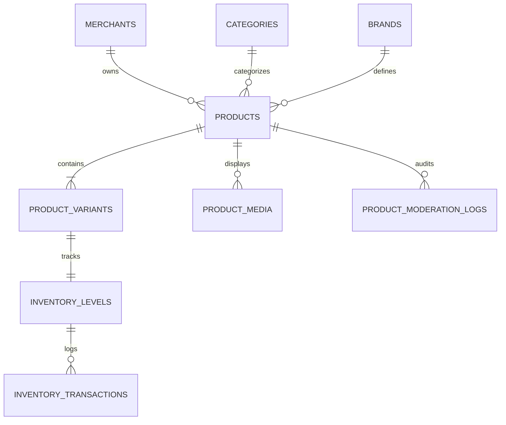
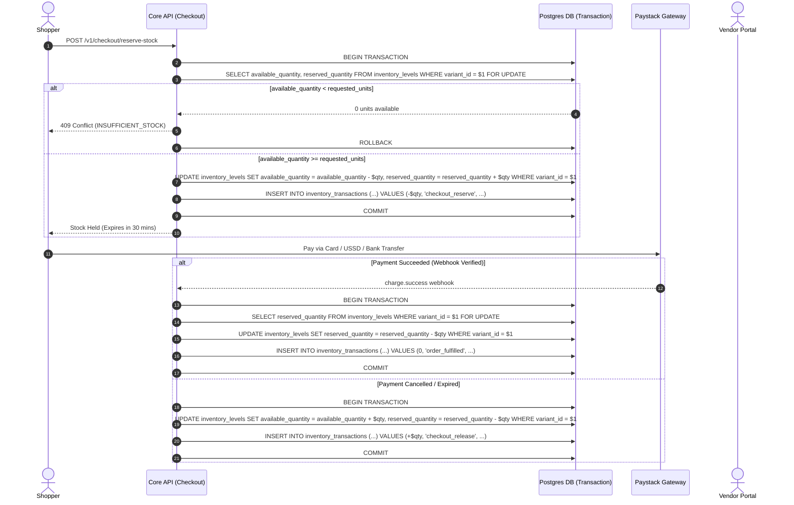
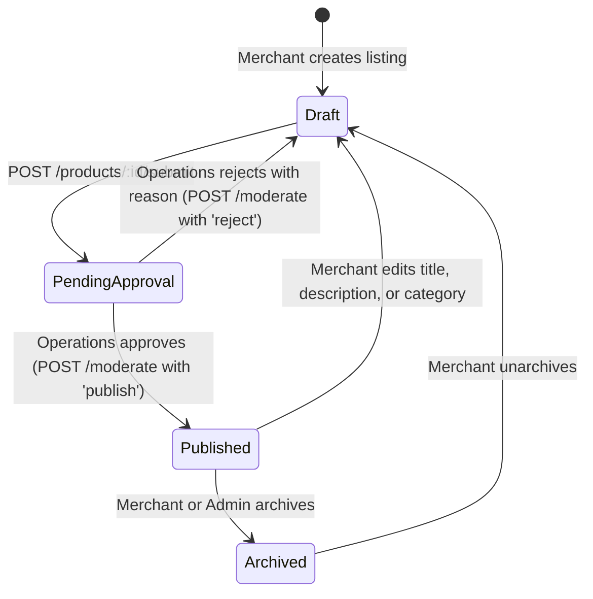

# SellFastBuyFast — Backend Architecture & Engineering Handoff
## Catalogue Management, Product Studio & Inventory Reservation Engine

**Target Audience:** Core Backend Engineering Team, Database Administrators, Operations API Engineers  
**System Domain:** Merchant Listing Lifecycle, Inventory Concurrency Locking, Moderation State Machine, Catalog Search Indexing  
**Version:** 2.4.0 (Production Blueprint)  
**Security Classification:** Highly Confidential / Enterprise Architectural Standard  

---

## 1. Executive Summary & Core Invariants

The **Catalogue Management & Product Studio** system governs the creation, modification, moderation, and real-time inventory management of all physical items sold across the **SellFastBuyFast** Nigerian e-commerce platform.

Because Nigerian retail marketplaces operate under high mobile concurrency and volatile stock movements, this module is built upon four strict non-negotiable architectural invariants:

1. **Zero Overselling Guarantee (Pessimistic Locking):** No customer can ever complete checkout for an item that is out of stock. Stock reservation occurs within an atomic database transaction using row-level locks (`SELECT ... FOR UPDATE`).
2. **Escrow & Listing Authenticity:** Products submitted by merchants must undergo compliance verification by platform Operations before public indexing. Any post-publication edit to title, description, or category automatically reverts the product to `draft` or triggers an automatic re-moderation cycle to prevent bait-and-switch tactics.
3. **Multi-Tenant Isolation via RLS:** All catalog read/write operations must be scoped strictly to the merchant's authenticated organization (`merchant_id`). Direct queries through Supabase client libraries are protected with Row Level Security (RLS) policies.
4. **Auditability & Event Streaming:** Every inventory step, stock update, and moderation transition produces an immutable audit ledger entry (`audit_events`) and triggers outbox events for Elasticsearch/Meilisearch sync.

---

## 2. PostgreSQL Data Architecture

### 2.1 Entity Relationship Diagram



### 2.2 Relational DDL Specifications

```sql
-- 1. Product Catalog Table
CREATE TABLE IF NOT EXISTS public.products (
    id UUID PRIMARY KEY DEFAULT gen_random_uuid(),
    merchant_id UUID NOT NULL REFERENCES public.merchants(id) ON DELETE CASCADE,
    category_id UUID NOT NULL REFERENCES public.categories(id) ON DELETE RESTRICT,
    brand_id UUID REFERENCES public.brands(id) ON DELETE SET NULL,
    title VARCHAR(200) NOT NULL,
    description TEXT NOT NULL,
    status VARCHAR(30) NOT NULL DEFAULT 'draft' CHECK (status IN ('draft', 'pending_approval', 'published', 'rejected', 'archived')),
    compare_price_minor BIGINT NULL CHECK (compare_price_minor IS NULL OR compare_price_minor > 0),
    rejection_reason TEXT NULL,
    moderated_by UUID REFERENCES auth.users(id) ON DELETE SET NULL,
    moderated_at TIMESTAMPTZ NULL,
    created_at TIMESTAMPTZ NOT NULL DEFAULT NOW(),
    updated_at TIMESTAMPTZ NOT NULL DEFAULT NOW()
);

-- Indices for rapid merchant querying & catalog filtering
CREATE INDEX IF NOT EXISTS idx_products_merchant_id ON public.products(merchant_id);
CREATE INDEX IF NOT EXISTS idx_products_merchant_status ON public.products(merchant_id, status);
CREATE INDEX IF NOT EXISTS idx_products_category_published ON public.products(category_id) WHERE status = 'published';

-- 2. Product Variants Table
CREATE TABLE IF NOT EXISTS public.product_variants (
    id UUID PRIMARY KEY DEFAULT gen_random_uuid(),
    product_id UUID NOT NULL REFERENCES public.products(id) ON DELETE CASCADE,
    sku VARCHAR(64) NOT NULL,
    title VARCHAR(120) NOT NULL DEFAULT 'Standard',
    price_minor BIGINT NOT NULL CHECK (price_minor > 0),
    barcode VARCHAR(64) NULL,
    weight_grams INTEGER NULL CHECK (weight_grams IS NULL OR weight_grams >= 0),
    is_default BOOLEAN NOT NULL DEFAULT TRUE,
    created_at TIMESTAMPTZ NOT NULL DEFAULT NOW(),
    updated_at TIMESTAMPTZ NOT NULL DEFAULT NOW(),
    CONSTRAINT uq_product_sku UNIQUE (product_id, sku)
);

CREATE INDEX IF NOT EXISTS idx_variants_product_id ON public.product_variants(product_id);
CREATE INDEX IF NOT EXISTS idx_variants_sku ON public.product_variants(sku);

-- 3. Inventory Levels Table (Atomic Live Quantity Tracker)
CREATE TABLE IF NOT EXISTS public.inventory_levels (
    variant_id UUID PRIMARY KEY REFERENCES public.product_variants(id) ON DELETE CASCADE,
    available_quantity INTEGER NOT NULL DEFAULT 0 CHECK (available_quantity >= 0),
    reserved_quantity INTEGER NOT NULL DEFAULT 0 CHECK (reserved_quantity >= 0),
    low_stock_threshold INTEGER NOT NULL DEFAULT 3 CHECK (low_stock_threshold >= 0),
    updated_at TIMESTAMPTZ NOT NULL DEFAULT NOW()
);

-- 4. Product Media Table
CREATE TABLE IF NOT EXISTS public.product_media (
    id UUID PRIMARY KEY DEFAULT gen_random_uuid(),
    product_id UUID NOT NULL REFERENCES public.products(id) ON DELETE CASCADE,
    media_url TEXT NOT NULL,
    media_type VARCHAR(20) NOT NULL DEFAULT 'image' CHECK (media_type IN ('image', 'video')),
    alt_text VARCHAR(200) NULL,
    sort_order INTEGER NOT NULL DEFAULT 0,
    created_at TIMESTAMPTZ NOT NULL DEFAULT NOW()
);

CREATE INDEX IF NOT EXISTS idx_product_media_product_sort ON public.product_media(product_id, sort_order ASC);

-- 5. Inventory Ledger & Concurrency Audit Log
CREATE TABLE IF NOT EXISTS public.inventory_transactions (
    id UUID PRIMARY KEY DEFAULT gen_random_uuid(),
    variant_id UUID NOT NULL REFERENCES public.product_variants(id) ON DELETE CASCADE,
    delta INTEGER NOT NULL,
    action_type VARCHAR(40) NOT NULL CHECK (action_type IN (
        'merchant_set',
        'checkout_reserve',
        'checkout_release',
        'order_fulfilled',
        'return_restock',
        'admin_adjustment'
    )),
    reference_id VARCHAR(100) NULL, -- order_id or idempotency_key
    actor_id UUID NULL,
    note TEXT NULL,
    balance_after INTEGER NOT NULL,
    created_at TIMESTAMPTZ NOT NULL DEFAULT NOW()
);

CREATE INDEX IF NOT EXISTS idx_inventory_tx_variant ON public.inventory_transactions(variant_id, created_at DESC);
```

---

## 3. Concurrency & Stock Reservation Architecture

### 3.1 The Race Condition Threat
In high-demand scenarios (e.g. Flash sales, promotional pushes in Lagos), multiple shoppers may attempt to checkout the last 2 units of a single SKU simultaneously. A naive `UPDATE ... SET available_quantity = available_quantity - 1` without reservation checks causes overselling and unfulfillable orders.

### 3.2 Two-Phase Checkout Stock Reservation Flow



### 3.3 Merchant Stock Update Invariant
When a vendor uses the Portal's **Quick Adjust / Stepper Modal** to update inventory (`PATCH /v1/catalog-management/variants/:id/inventory`):
- The `available_quantity` is modified to the new count.
- The `reserved_quantity` MUST NOT BE OVERWRITTEN! Any active reservations held by shoppers in checkout remain intact.
- An entry is logged into `inventory_transactions` with `action_type = 'merchant_set'`.

---

## 4. Product Moderation & Publishing State Machine



### 4.1 Transition Rules:
1. **Submission Requirements:** A product can ONLY transition from `draft` to `pending_approval` if:
   - `title` length is between 3 and 180 characters.
   - `category_id` is an active non-root category node.
   - At least 1 variant exists with `price_minor > 0` and `sku` populated.
   - At least 1 media item exists with `mediaType = 'image'`.
   - `description` length is at least 20 characters.
2. **Auto-Reversion to Draft:** If a merchant updates a `published` product via `PATCH /v1/catalog-management/products/:id`:
   - If `title`, `description`, or `categoryId` was modified, the backend MUST automatically set `status = 'draft'` and notify the vendor that the listing requires re-approval before it is visible to shoppers again.
   - If only `comparePriceMinor` was modified, `status` remains `published`.

---

## 5. REST API Specifications

### 5.1 Create Product
- **Endpoint:** `POST /v1/catalog-management/merchant/:merchantId/products`
- **Headers:** `Authorization: Bearer <jwt>`, `Idempotency-Key: <uuid>`
- **Request Body:**
```json
{
  "title": "Italian Leather Men's Oxford Shoes",
  "description": "Handcrafted genuine leather footwear with padded insoles and non-slip rubber soles. Perfect for business and formal events.",
  "categoryId": "c2b3e4f5-1111-4444-8888-999900001111",
  "comparePriceMinor": 5500000,
  "variants": [
    {
      "sku": "SFBF-OXFORD-42",
      "title": "Size 42 / Black",
      "priceMinor": 4500000,
      "availableQuantity": 15
    }
  ],
  "media": [
    {
      "mediaUrl": "https://res.cloudinary.com/sellfast/image/upload/v1/shoes.jpg",
      "mediaType": "image",
      "altText": "Front view of Italian Leather Oxford Shoes",
      "sortOrder": 0
    }
  ]
}
```
- **Response (201 Created):**
```json
{
  "success": true,
  "data": {
    "id": "77777777-7777-7777-7777-777777770001",
    "merchantId": "22222222-2222-2222-2222-222222222201",
    "status": "draft",
    "title": "Italian Leather Men's Oxford Shoes",
    "createdAt": "2026-09-03T14:00:00.000Z"
  }
}
```

### 5.2 Submit for Operations Moderation
- **Endpoint:** `POST /v1/catalog-management/products/:id/submit`
- **Headers:** `Authorization: Bearer <jwt>`, `Idempotency-Key: <uuid>`
- **Response (200 OK):**
```json
{
  "success": true,
  "data": {
    "id": "77777777-7777-7777-7777-777777770001",
    "status": "pending_approval",
    "submittedAt": "2026-09-03T14:02:00.000Z"
  }
}
```

### 5.3 Update Live Variant Stock (Instant Stepper)
- **Endpoint:** `PATCH /v1/catalog-management/variants/:variantId/inventory`
- **Headers:** `Authorization: Bearer <jwt>`, `Idempotency-Key: <uuid>`
- **Request Body:**
```json
{
  "availableQuantity": 25
}
```
- **Response (200 OK):**
```json
{
  "success": true,
  "data": {
    "variantId": "88888888-8888-8888-8888-888888880001",
    "availableQuantity": 25,
    "reservedQuantity": 2,
    "updatedAt": "2026-09-03T14:05:00.000Z"
  }
}
```

---

## 6. Supabase Row Level Security (RLS) Guardrails

```sql
-- Enable RLS
ALTER TABLE public.products ENABLE ROW LEVEL SECURITY;
ALTER TABLE public.product_variants ENABLE ROW LEVEL SECURITY;
ALTER TABLE public.inventory_levels ENABLE ROW LEVEL SECURITY;
ALTER TABLE public.product_media ENABLE ROW LEVEL SECURITY;

-- 1. Products Policy: Vendors can only view and manage their own products
CREATE POLICY "Vendors manage own products"
ON public.products
FOR ALL
USING (
    merchant_id IN (
        SELECT id FROM public.merchants WHERE user_id = auth.uid()
    )
);

-- 2. Public Policy: Shoppers can view published products only
CREATE POLICY "Public read published products"
ON public.products
FOR SELECT
USING (
    status = 'published'
);

-- 3. Variants Policy: Enforce cascade ownership through product_id
CREATE POLICY "Vendors manage variants"
ON public.product_variants
FOR ALL
USING (
    product_id IN (
        SELECT id FROM public.products WHERE merchant_id IN (
            SELECT id FROM public.merchants WHERE user_id = auth.uid()
        )
    )
);

-- 4. Inventory Levels: Vendors can view and update inventory of their variants
CREATE POLICY "Vendors manage inventory"
ON public.inventory_levels
FOR ALL
USING (
    variant_id IN (
        SELECT pv.id FROM public.product_variants pv
        JOIN public.products p ON pv.product_id = p.id
        WHERE p.merchant_id IN (
            SELECT id FROM public.merchants WHERE user_id = auth.uid()
        )
    )
);
```

---

## 7. Backend Engineer Action Items

- [x] **Frontend Portal Implemented:** Enterprise data table with live KPI cards, low-stock warning indicators, instant stock adjustment stepper modal, and Product Studio with live interactive Shopper Mobile Preview.
- [ ] **DB Migrations:** Ensure `compare_price_minor` is added to `products` table and `inventory_transactions` is created.
- [ ] **Pessimistic Locking Verification:** Implement integration tests executing concurrent checkout requests on 1 unit of stock to verify zero-oversell guarantee under load.
- [ ] **Search Engine Index Invalidation:** On product transition to `published`, publish message to RabbitMQ/Kafka topic `catalog.product_published` to index listing into Elasticsearch/Meilisearch.
- [ ] **Automated Re-moderation:** Validate that modifying title or description of a `published` item triggers automatic rollback to `draft` with notification to merchant.
